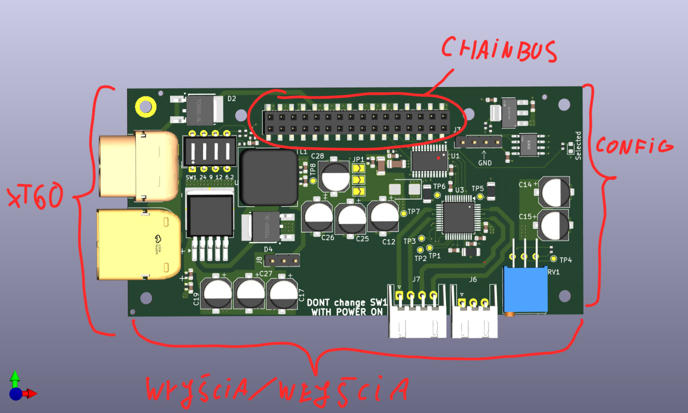

# Zestaw template'ów kompatybilnych z płytką MMS3 i systemem ChainBus

### Łączenie hat'ów

 Na jednym MMS3 można zamontować do 8 hatów. Łączy się przez wpinianie kolejnego Hat'a do złącza ChainBus wcześniejszego

### Komunikacja oraz sterowanie

 ChainBus jest w pełni cyfrowy. GPIO nie sterują bezpośrednio funkcjonalnością, tylko poprzez magistrale komunikacyjne i IC.

 Znaczy to, że zamiast używać GPIO do przełączania LED'a, odczytywania krańcówek czy zadawania PWM'a musisz zaimplementować jakiegoś IC który to robi. Np:

 MCU --> expander gpio po I2C --> Dioda LED

 MCU wybiera do którego hat'a się podpina przy użyciu bus switcha. To znaczy że magistrale I2C, SPI i UART są niezależne od siebie na każdym hat'ie (nie musisz się martwić o zajęte adresy I2C).

 Dodatkowo w celu identyfikacji każdego hat'a jest na nim pamięć EEPROM po I2C. Możesz użyć np. M24C64-W z obudową SOIC-8 i addresie 1010000 (przy A0 A1 A2 zwartych do GND)

### Zasilanie

 Przez złącze ChainBus idzie następujące zasilanie

|          |   Napięcie    | Prąd na wszystkie haty | Prąd dla jednego hat'a |
| -------- | :-----------: | :--------------------: | ---------------------: |
| 5V       |      5V       |           1A           |                  125mA |
| 12V stby |      12V      |          0.5A          |                   65mA |
| BRD_VIN  | Od 12V do 48V |          1.5A          |                  185mA |

 Prąd dla jednego hat'a został policzony w wypadku kiedy wszystkie 8 hat'ów jest zamontowanych. Jeśli na jeden MMS zamontujesz mniej hat'ów to każdy może pociągnąć więcej prądu.

 Hat'y powinny obsługiwać do 48V z BRD_VIN. Komponenty powinny być dostosowane aż do tego napięcia.

 Jeśli twoja płytka potrzebuje więcej mocy niż ile ChainBus daje, to można dodatkowo podłączyć Vin po XT60 która obsługuje około 60A.

 Jeśli potrzebujesz innych napięć to możesz użyć gotowej przetwonicy step-down z template'a. Można wybierać z niej 24V, 12V, 9V i 6V2. Wszystkie na 2A.

### Template Mechaniczny

 Nie możesz zmieniać wielkości PCB, rozstawienia otworów montażowych oraz pozycji złącz chainbus (02x16 SMD, 2.54 raster) żeby płytka była kompatybilna z ChainBus'em

 Jeśli są potrzebne będą w twoim projekcie, to na płytce zostały rozstawione złącza XT60 oraz konwerter step down. Te elementy nie zostały jeszcze przetestowane, ale powinny działać.

Jeśli twój projekt ich nie potrzebuje to możesz je na spokojnie usunąć.

### Wyprowadzenia

 Po środku płytki na górze jest złącze Chainbus. Na od front'u  jest żeńskie, na Back'u jest męskie.

 Na dolnej krawędzi płytki powinny być umieszczone złącza wyjścia/wejścia. Na lewej złacza XT60 jeśli ich używasz, a na prawej wszystkie elementy konfiguracyjne i debugowe (potencjometry, przyciski, LED'y).

 Domyślnie jako złącz używamy JST-XH 2.5mm. Producent mówi że obsługują do 3A

### Przykładowy hat
[Sterownik silników krokowych. Komunikacja po SPI](https://github.com/KoNaR-Hefajstos/MMS3_hat_stepper_controler)
